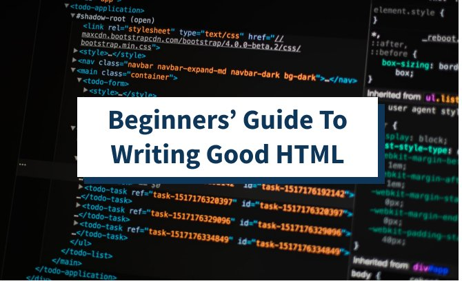

<html lang="en">
<head>
    <meta charset="UTF-8">
    <meta http-equiv="X-UA-Compatible" content="IE=edge">
    <meta name="viewport" content="width=device-width, initial-scale=1.0">
    <title>First Day1 Assignment</title>
    <link rel="stylesheet" href="style.css">
</head>
<body>
        
  

      
  <h1 id= "HomeTitle">Fundamentals of Web Technologies</h1>

    
 <h2>for UI (Front-End) Development</h2>

    
<h3>Hands-on Foundation Bootcamp Workshop</h3>

    
<h4>Internal</h4>

    <h3 id = "attenTitle"> <marquee behavior="scroll" direction="left">To  know more details  about the course and curriculam, please <a href="Syallabus.html">Click here for - Syallbys and registration.</a></>!</marquee>

    <h3>Introduction</h3>
    
Web technology (HTML, CSS, and Javascript) is a must-have skill for software development today. 
        In fact, it is a foundation for all modern software solutions. Without a strong foundation in web 
        technology, engineers are unable to meet the product quality and delivery time. This workshop provides
         a strong foundation to learn any front-end framework like Angular or React.

    
Though there are numerous courses available online, that are not effective as those trainings are long hours, 
        non-interactive and outdated. The external instructor (without real-time product/project development 
        experience) led trainings are not effective as well, as those trainings are packed with too many concepts 
        for a short period (2-3 Full day). This leaves the engineers with no time to practice their learning as 
        they are pressured with project deliverables. Also, the external trainers are not aware of the internal 
        project requirements and unable to relate to real-world problems

        Hence, we need customized interactive internal hands-on workshops for our engineers.

        <h3>Objectives:</h3>
        <ul>
            <ol>
            <li>To provide a strong foundation on web technology – HTML, CSS, and Javascript (which they work on day, 
                night and sometimes over the weekends too)</li>
            <li>Explain the importance of software craftsmanship principles, disciplines, best coding principles and practices, DOs and DON’Ts, code reviews and code optimization by creating re-usable 
                code/functions/utility libraries or frameworks with live examples</li>
            </ol>
        </ul>
        <h3>Schedule:</h3>
        <b>Half-a-day workshop</b> (3Hrs: Core: 1Hr(Q&A, troubleshoot, assignments reviews): 1Hr break)  
        <b>09:30 AM - 2:30 PM : (Mon+Thu  or Tue+Fri or Mon+Wed+Fri</b> So, the participants get to practice as well as support 
        project priorities

        <h3 id = "ruleTitle" >Rules, Terms and Conditions:</h3>
        <dl>
            <dd> - &nbsp; &nbsp;<b>On Time</b> (15 min early to setup laptop/environment/catchup)Every session - (No excuses for joining late)
            </dd>
            <dd>- &nbsp; &nbsp; Cannot skip a session – (if so, dropout from the bootcamp & re-register for the next series if you wish)</dd>
            <dd>-&nbsp; &nbsp; <b> No Access </b> to Mobile & Mail & IM (Official/Personal) during the workshop</dd>
            <dd>- &nbsp; &nbsp;Mandate to complete assignments. (<b> **No excuses**</b> [<u>  *project deliverables*</u>] for not doing)</dd>
            <dd>- &nbsp; &nbsp;Course Content is subject to change during the workshop, based on participants’ skill / knowledge / interest / participation</dd>
        </dl>
        
<h3>Requirements</h3>
<dl>
    <dd class = "lang-menu"> -&nbsp;&nbsp; Laptop </dd>
    <dd class = "lang-menu"> -&nbsp;&nbsp; VS Code(Setup Guide will be shared prior to the workshop)</dd>
    <dd class = "lang-menu">-&nbsp;&nbsp; Chrome Browser</dd>
    <dd class = "lang-menu"> -&nbsp;&nbsp; Basic Programming knowledge and experience</dd>
</dl>
<footer>
    &copy; 2021. Vidya Technologies. Pvt. Ltd.&trade; Elavate&reg; 2021 
</footer>

       <h2>Worksop outline</h2>  
  <h3>Session-1</h3>
  <dl>
    <dd> &nbsp;&nbsp; -Web Overview – Client/Server Apps – Clients: Browser, Desktop, Mobile – Servers: Apache, Node</dd>
    <dd>&nbsp;&nbsp;- Environment (Tools + Extensions) Overview – VS Code, Chrome | Firefox | Edge </dd>
    <dd>&nbsp;&nbsp;- VS Code (Shortcuts, Extensions, Configurations)</dd>
    <dd>&nbsp;&nbsp;- HTML (Structure, Tags, Attributes, Properties, Events)</dd>
    <dd>&nbsp;&nbsp;- CSS Basics – External Frameworks (Bootstrap, Foundation, Material UI, Semantic UI)</dd>
    <dd>&nbsp;&nbsp;- Assignment: Personal Profile Page – One Page with sections</dd>
</dl>
<h3>Session-2</h3>
<dl>
    <dd>&nbsp;&nbsp; - Assignment Review / Recap </dd>
    <dd>&nbsp;&nbsp; - Javascript –  Inline vs External (+CDN) </dd>
    <dd>&nbsp;&nbsp; - Programming – Fundamentals (IPO, REPL) </dd>
    <dd>&nbsp;&nbsp; - Introduction to Javascript – with the context of Compiler & Interpreter  </dd>
    <dd>&nbsp;&nbsp; - Comments – Single, Multi </dd>
    <dd>&nbsp;&nbsp; - Output: alert, console</dd>
    <dd>&nbsp;&nbsp;- Variables – var, let, const </dd> 
    <dd>&nbsp;&nbsp; - <b> Statements </b></dd></dl>
    <ul>
        <li>Assignment</li>
        <li>Computation</li>
        <li>Condition: if... else , switch</li>
        <li>Loop: for, while*, do..., while</li>
        <li>try.. catch</li>
    </ul>
 - Assignments: Enhance Personal profile page    
 <h3>Session-3</h3>
     <dl>
         <dd>&nbsp;&nbsp; - Assignment Review/Recap</dd>
         <dd>&nbsp;&nbsp; - Function- Arguments, return</dd>
         <dd>&nbsp;&nbsp; - Assignment: function sum</dd>
         <dd>&nbsp;&nbsp; - Function – named vs anonymous, expression, IIFE, calling (call, apply)</dd>
         <dd>&nbsp;&nbsp; - Variable scope (global, function, block)</dd>
     </dl>
<h3>Session-4</h3>
<dl>
    <dd>Assignment Review/ Recap</dd>
    <dd>&nbsp;&nbsp; - Object Construction- with/without function</dd>
    <dd>&nbsp;&nbsp; - Properties, methods</dd>
    <dd>&nbsp;&nbsp; - this</dd>
    <dd>&nbsp;&nbsp; - prototypes</dd>
    <dd>&nbsp;&nbsp; - Built-in Object funtion - String, Array. Object Methods(for full list refer online MDN doc)</dd>
             <ul>
                <li > Trim, forEach, map, filter, ....</li>
             </ul>
        <dd>&nbsp;&nbsp; - JSON, Stringify, parse</dd>
        <dd>&nbsp;&nbsp; - Assignment: MDM - String, Array, Object Methods</dd>
<h3>Session-5</h3>
        <dl>
            <dd>&nbsp;&nbsp; - Assignment Review / Recap</dd>
            <dd>&nbsp;&nbsp; - DOM Structure</dd>
            <dd>&nbsp;&nbsp; - DOM Selectors (native vs jQuery vs querySelector)</dd>
            <dd>&nbsp;&nbsp; - DOM Manipulation (native vs jQuery)</dd>
            <dd>&nbsp;&nbsp; - Assignment – Profile Page – Show/Hide Sections</dd>
        </dl>
 <h3>Session-6</h3>
        <dl>
            <dd>&nbsp;&nbsp; - Assignment Review / Recap</dd>
            <dd>&nbsp;&nbsp; - DOM Structure</dd>
            <dd>&nbsp;&nbsp; - DOM Selectors (native vs jQuery vs querySelector)</dd>
            <dd>&nbsp;&nbsp; - DOM Manipulation (native vs jQuery)</dd>
            <dd>&nbsp;&nbsp; - Assignment – Profile Page – Show/Hide Sections</dd>
        </dl>
        <h3>Getting hands on with tools  during the session</h3>
        
        <table style="width:22%"> 
            <tr>
                <th>SI.No</th>
                <th>Name of Tool</th>

            </tr>
            <tr>
                <th>1</th>
                <th>Firefox</th>
            <tr>
                <th>2</th>
                <th> VS Code</th>
                <tr>
                <th>3</th>
                <th>live Server</th>
                <tr>
                <th>4</th>
                <th>Chrome</th>
            </tr>
        </tr>
    </tr>
</tr>

        </table>
        <footer>
        &copy; 2021. Unisys&trade; Elavate&reg; 2021 
    </footer>
